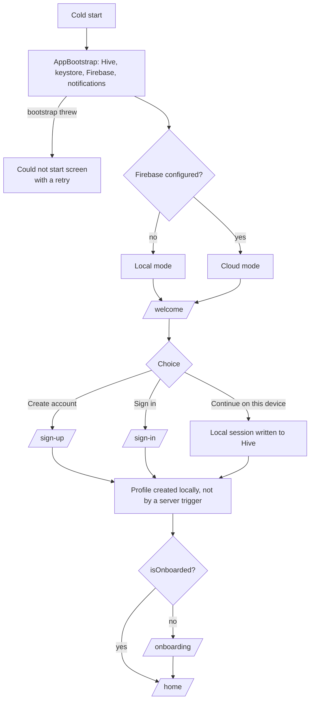
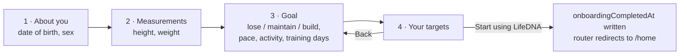
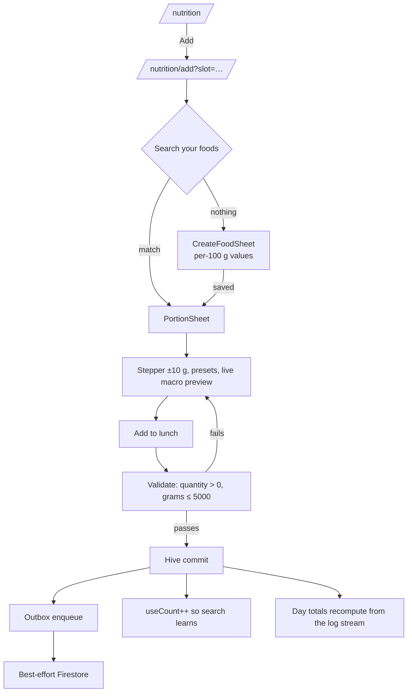
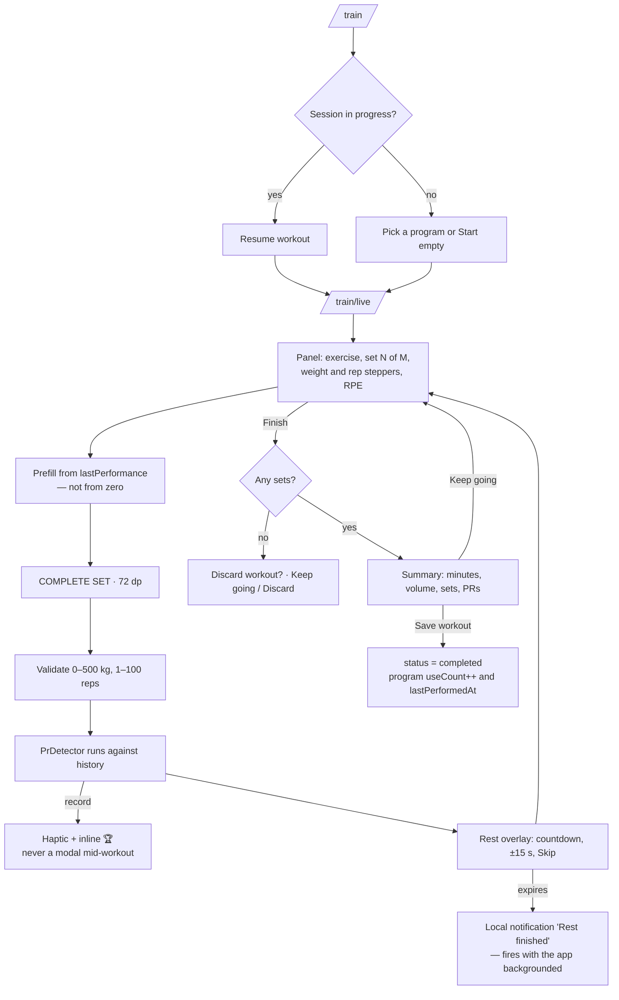
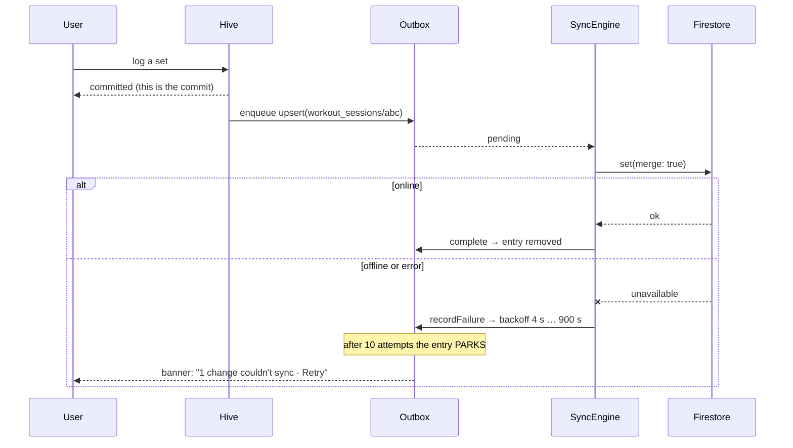
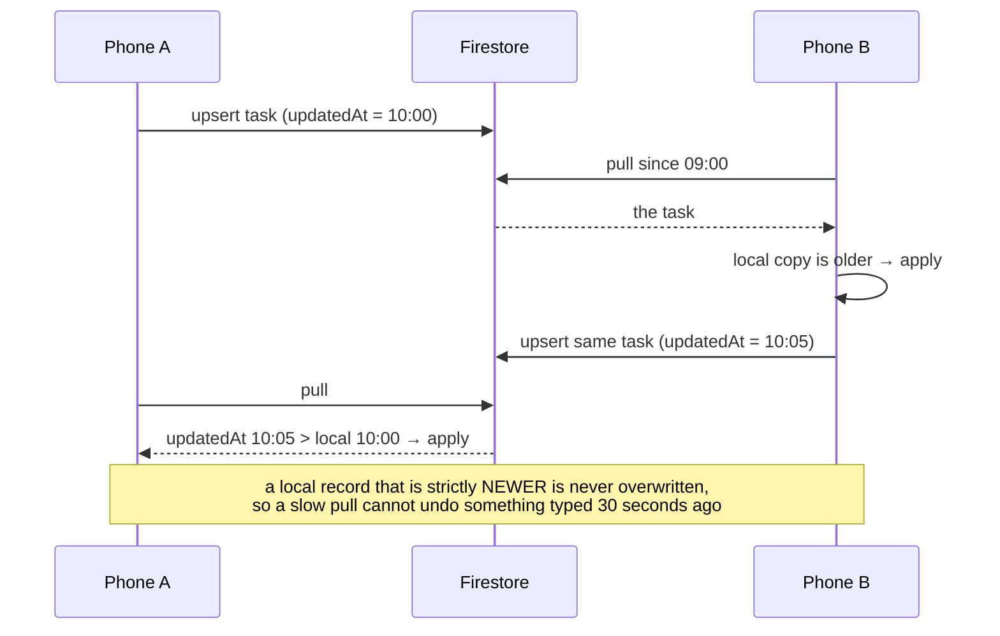
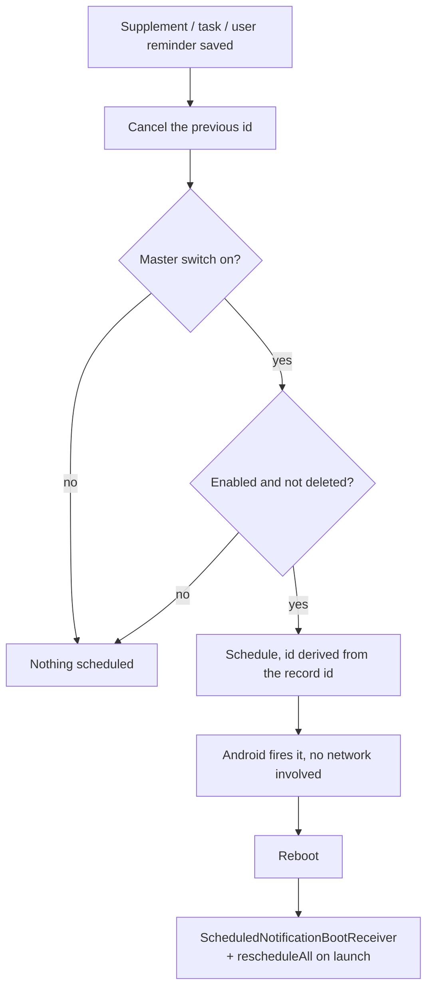
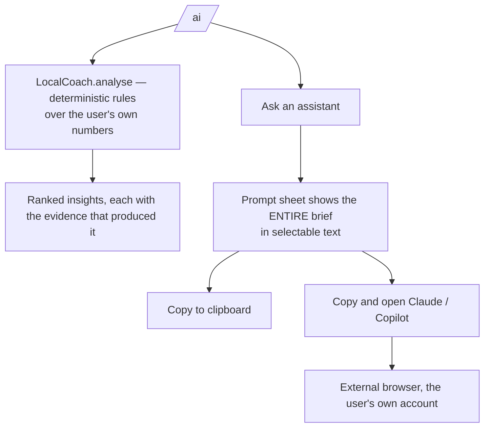
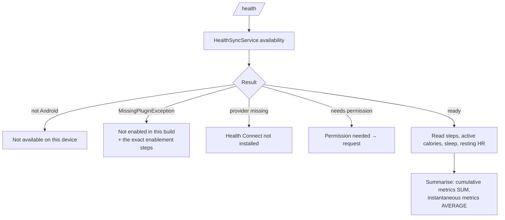

# 06 — User flow diagrams

Every flow below is exercised by an automated test; the test file is named
under each diagram.

## 1. First launch → a working dashboard



The profile is created on the device rather than by a Firestore trigger, so a
user who signs up on a plane still has a working account when they land.

*Tested by* `test/support/scenarios.dart` and `test/widget/features/auth_flow_test.dart`.

## 2. Onboarding



Step 4 shows the **derived** numbers — BMR, TDEE, training and rest-day
targets, protein floor, water, projected weekly change, and any safety clamp
that was applied — *before* anything is committed. A user who disagrees with a
number can walk back and change the input that produced it. A confirmation
dialog would have hidden the derivation.

Validation refuses a height outside 90–250 cm and a weight outside 30–300 kg
at entry, because bad body data propagates into every target the app computes.

*Tested by* `auth_flow_test.dart` — including the full four-step walk and the
out-of-range refusal.

## 3. Logging food



The energy consistency check in `CreateFoodSheet` compares the stated calories
against the Atwater reconstruction from the macros and warns on a divergence
above 15 %. Community food data fails this constantly, and saving it silently
would poison every daily total computed from it afterwards.

*Tested by* `test/widget/features/flows_test.dart` and
`test/unit/features/nutrition/nutrition_repository_test.dart`.

## 4. Live Gym Mode



Rest alerts go through **local** notifications, not FCM. A rest timer that
needs a network to fire is a rest timer that fails in the basement where it
matters.

*Tested by* `test/widget/features/live_workout_test.dart` — 23 tests covering
prefill, the steppers, PR announcement, the rest timer firing a notification,
discard, summary, and adding an exercise mid-session.

## 5. Offline write and reconciliation



Rapid edits to the same document collapse: the outbox is keyed by
`collection/docId`, so typing in a field queues one write rather than one per
keystroke.

*Tested by* `test/unit/core/sync/outbox_test.dart` and `sync_engine_test.dart`.

## 6. Two devices



Deletes replicate as tombstones (`deletedAt`), because a hard delete would be
resurrected by the other device's next pull.

## 7. Reminders



The master switch lives inside `NotificationService`, so a reminder created
while it is off cannot slip past it whichever feature creates it. The gate is
restored on every cold start; otherwise a user who turned reminders off would
be notified again after the next launch.

Notification ids are derived from the record id, so rescheduling **replaces**
rather than stacking a second alarm at the same time.

## 8. Google Calendar

```mermaid
flowchart TD
    A[/plan/ → Sync] --> B{Client id configured?}
    B -->|no| C[The action is not offered at all]
    B -->|yes| D{Connected?}
    D -->|no| E[Google sign-in, calendar.readonly scope]
    D -->|yes| F[events.list, −7 to +30 days]
    E --> F
    F --> G[Mirror into calendar_events, source = google]
    G --> H[Read-only: editing or deleting a mirrored event is refused]
    A2[Disconnect] --> I[Every google-sourced event is tombstoned]
```

The scope is **read-only**. LifeDNA shows the user's day; it has no business
writing to their calendar. Disconnecting removes the mirror, because keeping a
copy of someone's meetings after they revoked access would be indefensible.

## 9. AI Hub



Nothing here calls a model. There is no API key in the app, no request to any
AI provider, and no hidden payload — the user sees the exact text before it
goes anywhere, and it contains numbers only: no email, no name, no identifier.

*Tested by* `test/unit/features/ai_hub/ai_coach_test.dart`, including an
assertion that the brief contains no `@` and no `uid`.

## 10. Health sync



In the shipped MVP the native handler is not registered, so the screen reports
"Not enabled in this build" and lists what a developer must do. It renders no
step count. **A screen showing plausible-looking numbers that were invented
would be worse than a screen showing nothing.**
